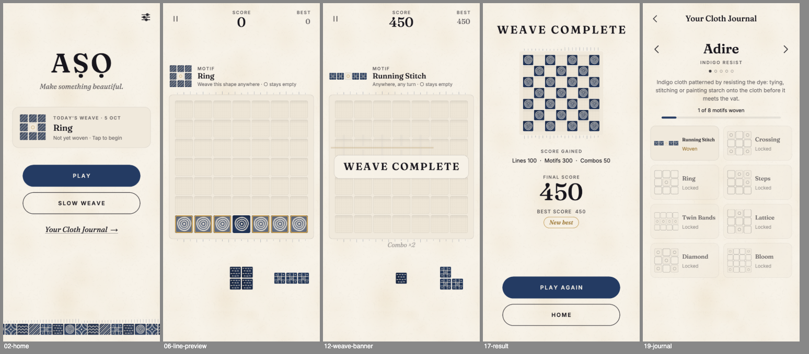

# AṢỌ

A calm, mobile-first textile puzzle inspired by Nigerian cloth, beginning with Yorùbá adire.

Drag pieces of cloth onto a 7×7 loom. Complete a row or column and it unravels. Weave the
motif shown above the board and it is added to your Cloth Journal. Main play has no timer.

Built with TypeScript, Phaser 3, Vite and localStorage. There is no backend.

**Play it:** https://tichoo07.github.io/aso-game/ (published automatically from `main` by
`.github/workflows/deploy.yml`)



---

## 1. Project structure

```
aso/
├── index.html                 Mobile viewport, safe areas, boot placeholder
├── public/                    PWA manifest + icon (served as-is)
├── src/
│   ├── main.ts                Fonts, DPR-correct canvas, resize, scene list
│   ├── services.ts            App singletons: save store, audio, haptics
│   │
│   ├── game/                  Pure rules. No Phaser, no DOM. Fully unit-tested.
│   │   ├── types.ts           Board, Shape, Piece, Coord
│   │   ├── constants.ts       BOARD_SIZE = 7, TRAY_SIZE = 3
│   │   ├── board.ts           Placement validation, line detection, clearing
│   │   ├── shapes.ts          ASCII shape → compiled Shape
│   │   ├── patterns.ts        Pattern compiling (with rotations) + detection
│   │   ├── scoring.ts         Line / pattern / combo scoring
│   │   ├── pieces.ts          Fair, seeded tray generation
│   │   ├── gameOver.ts        "Can anything still be placed?"
│   │   ├── state.ts           GameState + applyMove (the whole turn pipeline)
│   │   └── daily.ts           Date-seeded daily challenge
│   │
│   ├── data/                  Content. Edit these to add things; no logic changes needed.
│   │   ├── shapes.ts          Every piece shape (ASCII)
│   │   ├── collections/       Textile collections: motifs (cloth) + patterns (objectives)
│   │   │   ├── types.ts
│   │   │   ├── adire.ts       Playable in v1
│   │   │   ├── upcoming.ts    Aṣọ Òkè, Lagos, Eastern, Northern (coming soon)
│   │   │   └── index.ts       Registry + journal order
│   │   ├── i18n/              en (complete), yo (partial, beta)
│   │   └── index.ts           Compiled shapes + gameConfigFor(collection)
│   │
│   ├── scenes/                Boot, Splash, Home, Game, Result, Journal, Settings
│   │   └── BaseScene.ts       Shared background, theme, resize → layout()
│   │
│   ├── ui/                    Phaser view components
│   │   ├── textiles/          Procedural cloth: Canvas2D painters → GPU textures
│   │   ├── BoardView.ts       The loom: pooled sprites, previews, clear/weave animations
│   │   ├── TrayView.ts        The three waiting pieces
│   │   ├── PieceSprite.ts     A piece drawn as cloth cells
│   │   ├── PatternPreview.ts  Objective / journal motif drawings
│   │   ├── Button, IconButton, Toggle, Modal
│   │   ├── layout.ts          Responsive frame (design units, safe areas, DPR)
│   │   ├── theme.ts           Palette + high-contrast theme
│   │   ├── motion.ts          Reduce-motion aware animation helpers
│   │   └── text.ts, transitions.ts
│   │
│   ├── audio/                 AudioManager + synthesised placeholder sounds + ambience
│   ├── storage/save.ts        Versioned save data, migration, localStorage store
│   └── utils/                 Seeded RNG, dates, haptics
└── tests/                     Vitest unit tests for all core logic
```

The core rule: **`src/game` never imports Phaser.** Every rule is a pure function on plain
data, so it can be tested in Node and reused later (a server-verified daily, a native port,
a solver).

---

## 2. Run locally

Requires Node 20+.

```bash
npm install
npm run dev        # http://localhost:5173 (also on your LAN, for testing on a phone)
npm test           # 76 unit tests for the game logic
npm run typecheck
```

To try it on a real phone, open the **Network** URL that `npm run dev` prints, on the same
Wi-Fi.

---

## 3. How the game state works

A run is one plain, serialisable object. It is never mutated:

```ts
interface GameState {
  mode: 'classic' | 'slow' | 'daily';
  board: { size: 7; cells: number[] };   // 0 = empty, n = motif index of the cloth there
  tray: (Piece | null)[];                // the three waiting pieces
  score: number;
  streak: number; movesSinceClear: number;   // combo tracking
  objectiveId: string | null;            // current pattern objective
  rngState: number;                      // seeded RNG, so runs are reproducible
  nextUid: number; turn: number; over: boolean;
  stats: RunStats;                       // per-category score, lines, motifs woven
  daily: { key; objectiveId; completed } | null;
}
```

Each placement goes through **`applyMove(config, state, slot, row, col)`**, which returns
`{ state, result }` (or `null` for an illegal move). It runs the turn in this order:

1. place the piece (`placeShape`)
2. detect completed rows
3. detect completed columns (`findCompletedLines`)
4. detect the objective pattern (`findPattern`). It must include a just-placed cell.
5. collect every cell to remove (lines ∪ pattern)
6. clear them (`clearCells`)
7. score (`scoreMove`, `advanceCombo`)
8. deal a new tray once all three pieces are used (`generateTray`)
9. check game over (`isGameOver`). Slow Weave never ends: it loosens the cloth instead.

`result` describes what happened (placed cells, rows, cols, pattern match, points, refill,
game over). `GameScene` reads it and plays the matching animations, so the view never
re-derives rules. `previewMove` runs steps 1–4 without committing; the drag preview uses it
to outline everything a drop would clear.

**Scoring** (`src/game/scoring.ts`): 1 line = 100, 2 = 250, 3 = 450, then +300 per extra
line. A woven pattern = 300. Each consecutive clearing move adds a combo bonus of 50 × (streak − 1),
capped at 500. A streak survives two placements without a clear and ends on the third.

**Fair dealing** (`src/game/pieces.ts`): pieces are dealt by weight, with these limits:
- never three of the same shape, and never more than two large pieces in one tray;
- large pieces grow likelier as the score rises, and small pieces when the board is crowded;
- the tray is chosen so **all three pieces can be placed in some order** (a bounded search that
  includes the lines they clear). If the board makes that impossible, at least one piece will
  fit whenever any shape could.

The game can still be lost through placement choices, but never because of an impossible
deal.

**Persistence** (`src/storage/save.ts`): best score, settings, unlocked patterns, active
collection, collection progress, daily records (the last 60 days) and lifetime stats are
stored in localStorage. The format is versioned. `migrateSave` repairs anything malformed,
and the game keeps running in memory if storage is unavailable (for example, private mode).

---

## 4. Add a new piece

Open `src/data/shapes.ts` and add an entry:

```ts
{ id: 'plus', name: 'Plus', tier: 'large', weight: 2, rows: ['.#.', '###', '.#.'] },
```

- `rows` uses `#` for a cell and `.` for empty space.
- `weight` is its relative frequency.
- `tier` (`small` | `medium` | `large`) feeds the fairness rules and the difficulty curve.
- Pieces don't rotate in play, so add each orientation as its own entry.
- The tests require every shape to fit the 7×7 board and to have at most 4 cells. To allow
  larger pieces, raise `MAX_CELLS` in `src/ui/PieceSprite.ts` and change that test.

Then run `npm test`.

---

## 5. Add a new textile pattern (objective)

Patterns live in their collection's data file, e.g. `src/data/collections/adire.ts`:

```ts
{
  id: 'adire.window',          // globally unique; used for unlock persistence
  name: 'Window',
  rotations: true,             // also accept 90°/180°/270° turns
  grid: [
    '##',
    'oo',                      // o = resist: these cells must stay EMPTY
    '##',
  ],
},
```

The grid uses three characters:

| char | meaning |
| --- | --- |
| `#` | woven: the cell must hold cloth |
| `o` | resist: the cell must be empty, like the space the dye never reached |
| `.` | free: anything |

Order matters: new players meet objectives in list order, and the journal shows them in the
same order. Validation (equal row widths, allowed characters, at least one `#`, fits the board)
runs in the test suite and at startup.

**Cultural content rule:** pattern names describe geometry only. A traditional name or
meaning goes in `provenance: { note, source }`, and only with a verifiable source. The
journal is built to show provenance only when it exists.

### New cloth looks (motifs)

The look of the cloth pieces is procedural. A **motif** is a painter plus colours:

```ts
motifs: [{ painter: 'rings', ground: '#243B63', dye: '#F3EBDC' }, ...]
```

The painters (`rings`, `stitches`, `lattice`, `stripes`, `chevron`, `petals`) live in
`src/ui/textiles/painters.ts`. To add one:
1. add its name to the `MotifPainter` union in `src/data/collections/types.ts`;
2. add a function to `PAINTERS` in `painters.ts`, drawing in the dye colour on a `size × size`
   canvas.

Each painter's output is layered over a mottled ground, then gets crackle, dye bleed, a
weave grain and a vignette. Textures are generated once at boot, in normal and
high-contrast variants. No image files are needed.

---

## 6. Add a new collection

1. Create `src/data/collections/<name>.ts` exporting a `CollectionDef`:

   ```ts
   export const ASO_OKE: CollectionDef = {
     id: 'aso-oke',
     name: 'Aṣọ Òkè',
     subtitle: 'Hand-loomed strip cloth',
     description: 'Narrow woven strips, sewn edge to edge into a wider cloth.',
     status: 'available',                       // 'coming-soon' shows it locked in the journal
     palette: ['#C29A52', '#B9654B', '#243B63', '#F3EBDC'],
     motifs:   [ /* 4–8 MotifSpecs */ ],
     patterns: [ /* PatternDefs, ids prefixed 'aso-oke.' */ ],
   };
   ```

2. Register it in `COLLECTIONS` in `src/data/collections/index.ts`. That array sets the journal
   order.

Aṣọ Òkè, Lagos, Eastern Nigeria and Northern Nigeria already exist as `coming-soon` stubs in
`upcoming.ts`. To make one playable, fill in its motifs and patterns and set it to
`available`. The journal saves the collection the player is viewing as `activeCollection`,
and Play, Slow Weave and the Daily Weave all use it. Textures for every collection are
generated at boot.

---

## 7. Daily challenges

`src/game/daily.ts` needs no server:

- `dailySeed('2026-10-05')` hashes the local date into a 32-bit seed.
- `createDailyChallenge(config, dateKey)` uses that seed to pick the day's motif and scatter
  3–5 starting pieces. It never completes a line or the motif up front.
- `createDailyGame` starts a `daily` run from that cloth. Its piece RNG is also seeded, so the
  same date and the same moves always produce the same game (covered by tests).
- Completion and the day's best score are saved under `save.daily[dateKey]`. Home shows
  whether today's weave is done.

Ways to extend it:

- **Hand-authored days:** keep a map like `{ '2026-12-25': { objectiveId, board: [...] } }` in
  `src/data/` and check it at the top of `createDailyChallenge` before falling back to the seed.
- **Different rules per day** (fewer pieces, a target score, a fixed tray sequence): add fields
  to `DailyChallenge` and read them in `createDailyGame` / `GameScene`.
- **Reshuffle every future daily** after changing the generator: bump `DAILY_VERSION`.
- **Leaderboards later:** because a run is deterministic from `(dateKey, moves)`, a server
  can verify a score by replaying the submitted move list with `applyMove`.

---

## 8. Build for production

```bash
npm run build      # type-checks, then bundles to dist/
npm run preview    # serve dist/ locally to check it
```

`dist/` is a static site with relative paths (`base: './'`). Upload it to any static host
(Netlify, Vercel, Cloudflare Pages, GitHub Pages, S3) under any sub-path. Fonts are bundled
locally, so nothing is fetched from a CDN. The bundle is about 350 KB gzipped, mostly
Phaser.

For app stores, wrap `dist/` with Capacitor. To use native haptics, pass a driver to
`app().haptics.setDriver(...)` that calls Capacitor Haptics; the web Vibration API is not
available on iOS Safari.

---

## Design notes

**Palette:** Ink `#17151C`, Warm Ivory `#F7F2E8` (background), Indigo `#243B63` (cloth),
Clay `#B9654B`, Ochre `#C29A52` (highlights, weave threads), Forest `#40584A`. Type is
Fraunces, a soft editorial serif that covers Ṣ and Ọ, with Inter for UI. Both fonts are
bundled.

**Rendering:** the canvas backing store is sized in device pixels and displayed with
`zoom = 1/dpr`, so it is sharp on retina screens. Layout uses design units scaled to the
screen, inside a portrait column that is centred on wide screens. The board is always square.

**Performance:** every board, tray and drag sprite is created once and reused (pooled).
Dragging and animating allocate nothing per frame. Textures are generated once and mipmapped.
Tested at a steady 59–60 fps at iPhone resolution. Restarting scenes repeatedly leaves
object and listener counts unchanged.

**Accessibility:** reduce motion (it defaults to the OS setting and replaces movement with
short fades), high contrast (darker cloth, ink outlines, stronger text), and toggles for sound
and haptics. Touch targets are at least 48 units, and each tray slot's touch area is a full
third of the tray. State never relies on colour alone: resist cells carry a ring, toggles say
On/Off, the drop preview uses outlines, unplaceable pieces dim, and progress is written out
as well as drawn.

**Audio:** every sound is soft, short and synthesised as a placeholder. The ambience is a
low drone with occasional distant notes. To use recorded audio, put the files in `public/audio/` and call
`app().audio.registerSample('line_clear', 'audio/clear.ogg')`.

**Language:** English is complete. Yorùbá is a **partial beta** covering only a few short
labels, with everything else falling back to English. A native speaker should review and
extend `src/data/i18n/yo.ts` before it ships.

**Out of scope for the MVP:** multiplayer, accounts, chat, characters, story, shops, battle
pass, energy, lives, NFTs, 3D and AI opponents.
